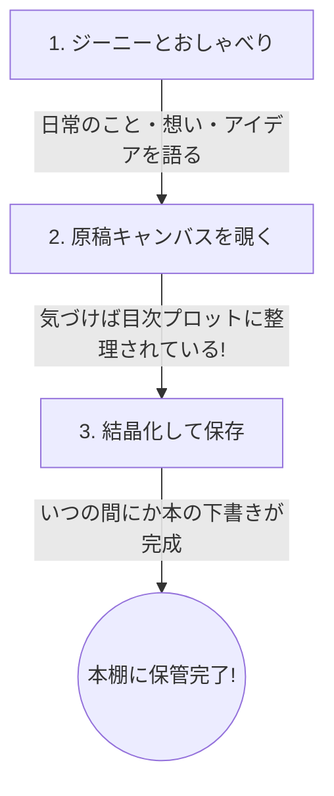

# 🧞 ジーニー モニター募集・配布準備キット

本ドキュメントは、Kindle執筆伴走AIアシスタント「ジーニー（Magic Lamp Engine）」のモニター配布・テストをスムーズに進めるための準備資料です。

「最初から本を書く」と身構えさせるのではなく、**「日常の想いや考えをジーニーに話しかけて、楽しくおしゃべり（壁打ち）する」**ことを主軸にアピールし、その対話を通じて自然と本の構成（プロット）が育っていく体験を届ける設計にしています。

---

## 📌 1. モニター募集の背景と目的

「ジーニー」は、ユーザーが何気なく語った言葉や想いを優しく受け止め、おしゃべりを通じて自然と本の構成案（プロット）や原稿の土台を紡ぎ出すAIです。今回のモニターテストでは、以下の検証・改善を目的とします。

*   **対話のハードルの低さ検証**: 「本を書くぞ」と意気込まなくても、日常の雑談や考えの吐き出しから自然に対話をスタートできるか。
*   **おもてなし（オンボーディング）の体験検証**: スマホへの追加（PWA）や、最初の呼び名設定からスムーズにジーニーとの「おしゃべり」に移行できるか。
*   **フィードバックの収集**: ジーニーとの対話が心地よかったか、話しているうちに「これ本になるかも」というワクワク感が生まれたか。

---

## 💬 2. モニター別 案内メッセージ（テンプレート）

モニター候補それぞれの特性に合わせ、「おしゃべり」「思考の整理（壁打ち）」を前面に押し出した案内文です。

### 1️⃣ 84歳おばあちゃん向け（LINEデビュー間もない）
> [!NOTE]
> **特徴と工夫**: 
> *   「本を書く」という言葉は少し難しく感じられるため、「今日のことや昔の思い出をおしゃべりする相手」として紹介します。
> *   もとさんが設定代行済なので、URLを開いて最初の一言を話しかけるだけの手順に絞っています。

```text
〇〇おばあちゃん、おはようございます！もとです。

おばあちゃんのスマホに、今日あったことや昔の思い出を
楽しくおしゃべりできる、かわいいAIの『ジーニー』を準備しました！🧞‍♂️✨

私がスマホでお話しできるように設定しておいたので、
おばあちゃんはボタンを押して、ジーニーに「こんにちは」と
話しかけるだけで、いつでもおしゃべりを始められます。

こちらの青い文字（リンク）を押すと、ジーニーのお部屋が開きます。
↓↓↓
https://moto-sideline.github.io/-/ 

【おしゃべりのはじめかた】
1. 上の青い文字を押します。
2. ジーニーが「こんにちは！」と待っています。
3. 画面の下にある白い枠を指でトントンと押します。
4. 「よろしくね」とか「今日はお天気がいいね」など、
   なんでもいいので文字を打って、右側の「紙飛行機」のマークを押してください。

ジーニーはおばあちゃんのペースに合わせて、優しく丁寧にお返事してくれます。
今日楽しかったこと、昔の楽しかったお話など、何でもジーニーに話しかけてみてくださいね。
お時間があるときに、のんびりおしゃべりを楽しんでもらえたら嬉しいです！
```

---

### 2️⃣ 65歳女性向け（執筆に興味あり・日記を書いている）
> [!NOTE]
> **特徴と工夫**:
> *   日記の語り相手（壁打ち相手）としてのジーニーをアピールします。
> *   「ただおしゃべりしているだけなのに、気づけばそれが素敵な物語の目次になっていく」という魔法のような体験を伝えます。

```text
〇〇さん、こんにちは！もとです。

普段、素敵な日記を書かれている〇〇さんに、
ぜひ試していただきたい「おしゃべりAI」を作りました！

名前は『ジーニー』といいます。
日記に書いているような日常のふとした気づきや、昔の思い出、
今考えていることをそのままジーニーに話しかけてみてください。
ジーニーが優しくあなたの言葉を受け止め、おしゃべりの相手をしてくれます。

そして面白いことに、ジーニーとおしゃべりを楽しんでいるだけで、
あなたの想いやエピソードが、いつの間にか「1冊の本の目次（プロット）」のように自動的にきれいに整理されていくんです！

『ジーニー』はこちらのURLから使えます。
↓↓↓
https://moto-sideline.github.io/-/ 

🔮 はじめの設定（5分ほどで完了します）
1. アプリを開くと、左側に【⚙️設定】（歯車のマーク）があります。
2. 「APIキーを取得する（別タブで開く）」というボタンを押します。
3. 画面で「Create API Key」を押して、出てきた英語と数字の羅列をコピーします。
4. 設定画面に戻り、コピーした文字を貼り付けて「保存して覚醒」を押します。
5. あなたの「お名前（ニックネーム）」も登録しておくと、ジーニーがその名前で優しく呼びかけてくれるようになります！

まずは「本にすること」は気にせず、日々のちょっとしたおしゃべり相手として使ってみてください。
「話していて楽しかったか」「使いにくかったところはないか」など、のんびり感想を聞かせていただけるととても嬉しいです！
```

---

### 3️⃣ 60歳男性向け（ビジネスマン・鋭い意見を期待）
> [!NOTE]
> **特徴と工夫**:
> *   「思考のアウトプット・整理（壁打ち）ツール」としての側面を強調します。
> *   雑多な思考の壁打ちから、自動的に体系的な構成（プロット）が構築されていく効率性をアピールします。

```text
〇〇さん、お疲れ様です。もとです。

本日は、私が開発を進めている対話型・思考整理AI『ジーニー（Magic Lamp Engine）』の
テストモニターのお願いでご連絡いたしました。

このツールは、頭の中にある雑多なビジネスアイデアや、これまでの経験、
日々の問題意識などをAIに「吐き出す（壁打ちする）」ためのアシスタントです。
会話を通じてジーニーが論点を整理し、ユーザーがただ語るだけで、
気づけば体系的な「章構成（本のプロット）」へと仕立て上げてくれます。

最初は本の完成を目指す必要はありません。まずはご自身のビジネスアイデアの
壁打ち相手・思考整理ツールとして使い心地を試していただければ幸いです。

▼ ジーニー（Magic Lamp Engine）URL
https://moto-sideline.github.io/-/ 

💡 ご利用開始手順
1. 上記URLを開きます（スマホのホーム画面に保存してアプリ化も可能です）。
2. 【⚙️設定】より、Google AI Studio（無料）から取得したGeminiのAPIキーを入力し、「保存して覚醒」を行ってください。
3. チャット画面で、最近考えているビジネスのテーマやアイデアなどを、箇取りでも良いので投げかけてみてください。
4. 対話が進むにつれ、画面中央の「原稿キャンバス」に構成案が整理・蓄積されていきます。

ビジネス経験豊富な〇〇さんの視点から、「壁打ち相手としての対話の質」「思考の整理能力」「UIの直感性」などについて、気づいた点や改善案をいただけますと幸いです。

よろしくお願いいたします。
```

---

### 4️⃣ SNSでの公募向け
> [!NOTE]
> **特徴と工夫**:
> *   「本を書く」というハードルを下げ、「AIとの楽しいおしゃべり」からスタートできることを強調します。
> *   「いつの間にか本になる」ワクワク感をアピールします。

```text
【無料モニター募集！🧞‍♂️✨】
「いつか本を書いてみたいけれど、何から書けばいいか分からない…」
そんなあなたへ！

まずはAIと楽しく「おしゃべり」することから始めてみませんか？
あなたの何気ない日常の想いや、大好きなこと、頭の中のアイデアを優しく受け止め、整理してくれる対話AI『ジーニー（Magic Lamp Engine）』のモニターを募集します！

🌟 ジーニーの体験：
・最初はただの「おしゃべり」や「アイデアの吐き出し」でOK！
・話しかけるだけで、ジーニーが優しくお返事＆思考を整理
・対話が深まると、自動で本の目次（プロット）が魔法のように作られていきます

📱 スマホのブラウザから、アプリのように手軽に使えます。
（※利用にはGoogleの無料APIキーが必要です。かんたん設定ガイドあり）

「AIとおしゃべりしてみたい」「頭の中を整理してみたい」という方は、ぜひこの投稿にリプライ、またはDMでお知らせください！使い方やURLをお送りします。
まずは気軽に、ジーニーとお話ししてみましょう！✨
```

---

## 📱 3. スマホへのインストール・使い方ガイド

### ⚙️ スマホのホーム画面に追加する方法（PWA）
ジーニーは、スマホの画面にアイコンを追加することで、本物のアプリのように全画面でサクサク使えるようになります（無料）。

*   **📱 iPhone（Safari）の場合**
    1. 送られてきたURLを **Safari（サファリ）** で開きます。
    2. 画面下部にある **「共有」ボタン**（四角から矢印が飛び出しているマーク）をタップします。
    3. メニューを下にスクロールして、 **「ホーム画面に追加」** をタップします。
    4. 右上の **「追加」** ボタンをタップすると、ホーム画面にジーニーのアイコンが現れます！
    *   *※LINEや他のアプリの中から開いた場合は、右下の羅針盤マーク等を押して「Safariで開く」を選んでから操作してください。*

*   **📱 Android（Chrome）の場合**
    1. URLを **Chrome（クローム）** で開きます。
    2. 右上の **「メニューボタン」**（縦に3つ点が並んでいるマーク）をタップします。
    3. メニューから **「アプリをインストール」** または **「ホーム画面に追加」** をタップします。
    4. 画面の指示に従って追加すると、ホーム画面にアイコンが作成されます！

---

### 🧞 ジーニーとのおしゃべり 3ステップ
まずは難しく考えず、ジーニーを「話し相手」として使ってみてください。



1.  **まずは自由におしゃべりする**
    *   チャット画面でジーニーの質問（お名前や、最近気になっていること）に答えていきます。
    *   「本を書く」と気負う必要はありません。「今日こんなことがあってね」「昔こんな仕事をしていてね」と、友だちとおしゃべりするように話しかけてください。
2.  **整理された「キャンバス」を覗いてみる**
    *   おしゃべりしていると、左メニューの「原稿キャンバス（羽ペンのマーク）」に、ジーニーが会話の内容を整理した「本の目次（プロット）」を自動で組み立てていきます。
    *   「自分の話がこんなふうに整理されるんだ！」という変化を眺めるだけでも楽しめます。
3.  **気に入ったら保存する**
    *   対話が弾んで「これ、いつか本にしてみたいな」と思ったら、「原稿を研ぎ出し・出力（結晶化）」ボタンを押します。
    *   整理されたテキストがファイルとして保存され、アプリ内の「本棚（本のマーク）」に保管されます。

💡 **ワンポイントアドバイス**
「何を書けばいいかわからない…」という時も、そのまま「書くことが思いつかない」とジーニーに話してみてください。ジーニーがあなたの興味を優しく引き出す質問をしてくれます。

---

## 📝 4. フィードバックをもらう方法の検討

### 📋 フィードバック質問項目案（「おしゃべり体験」フォーカス版）

おしゃべり中心のアピールに合わせた、モニターへのアンケート質問項目です。

#### 1. 導入（API設定・インストール）について
*   **質問**: アプリを使える状態にするまで（APIの設定やスマホ画面への追加）は難しくなかったですか？
*   **選択肢**: とても簡単だった / 少し難しかったができた / 難しくて誰かの助けが必要だった

#### 2. 対話の「話しやすさ」について
*   **質問**: ジーニーとの対話は話しやすかったですか？（話し方、返事のペースなど）
*   **選択肢**: 友だちのように話しやすかった / 優しいと感じた / 少し冷たい・機械的に感じた / 返気が遅すぎる・早すぎる / その他

#### 3. 「いつの間にか整理される」体験について
*   **質問**: ジーニーとおしゃべりしているだけで、話が「本の目次（プロット）」として整理されていくのを見てどう思いましたか？
*   **選択肢**: 自分の体験が整理されて感動した・ワクワクした / 新鮮で面白かった / あまりよく分からなかった・ピンとこなかった

#### 4. 本への興味の変化について
*   **質問**: ジーニーと話する前と後で、「自分の本を書いてみたい（残してみたい）」という気持ちに変化はありましたか？
*   **選択肢**: 本を書いてみたい気持ちがとても強くなった / 機会があれば書いてもいいなと思った / 難しそうだと感じた

#### 5. 自由記述（一番良かったこと・改善してほしいこと）
*   **質問**: ジーニーを使ってみて、一番楽しかった瞬間や、「もっとこうなれば使いやすいのに」と思った点があれば、どんなことでも教えてください！
