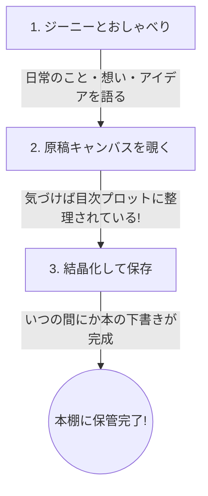

# 🧞 ジーニー モニター募集・配布準備キット

モニター募集からスマホインストール、使い方案内、フィードバック収集までを**この1ファイル**にまとめた準備資料です。各セクションをそのままコピペして使えます。

「最初から本を書く」と身構えさせるのではなく、**「日常の想いや考えをジーニーに話しかけて、楽しくおしゃべり（壁打ち）する」**ことを主軸にアピールし、その対話を通じて自然と本の構成（プロット）が育っていく体験を届ける設計にしています。

**ジーニーURL：** https://moto-sideline.github.io/-/

---

## 📌 1. モニター募集の背景と目的

「ジーニー」は、ユーザーが何気なく語った言葉や想いを優しく受け止め、おしゃべりを通じて自然と本の構成案（プロット）や原稿の土台を紡ぎ出すAIです。今回のモニターテストでは、以下の検証・改善を目的とします。

* **対話のハードルの低さ検証**: 「本を書くぞ」と意気込まなくても、日常の雑談や考えの吐き出しから自然に対話をスタートできるか。
* **おもてなし（オンボーディング）の体験検証**: スマホへの追加（PWA）や、最初の呼び名設定からスムーズにジーニーとの「おしゃべり」に移行できるか。
* **フィードバックの収集**: ジーニーとの対話が心地よかったか、話しているうちに「これ本になるかも」というワクワク感が生まれたか。

### 募集人数・価格の見せ方（運用メモ）

| 相手 | 目安人数 | 価格の見せ方 |
| :--- | :--- | :--- |
| 身近な人（おばあちゃん、日記派など） | 2〜3名 | 価格なし。「おしゃべり試してほしい」テスト枠 |
| ビジネス層・印税に関心がある人 | 1〜2名 | 価格あり。7,800円予定＋永続無料特典 |
| SNS・グループ公募 | 2〜3名 | 価格ありテンプレ or おしゃべり訴求テンプレ |

**初回は合計5〜8名**がフォローしやすい目安です。

---

## 💬 2. 募集文テンプレート

### 2-A. グループ向け（LINE・サロン等／価格・特典あり）

> **使いどころ**: 印税・Kindle出版に関心がある層。価格アンカーとモニター特典を出す。

```markdown
【とんでもない魔法のツールを作ってしまいました…🧞‍♂️✨】
〜最強のAI編集者と「印税収入」の自動販売機を作りませんか？〜

グループの皆様、こんばんは！もとです。

実はここ最近、裏で凄まじいプログラムを開発していました。
その名も、Kindle執筆パートナーシステム【魔法のランプ「ジーニー」】です！

「いつかはKindle本を出して、印税収入を得てみたい」
そう思ったことはありませんか？
前提として、
「何を書けばいいか分からない」
「プロット（構成）を作るのが面倒」
「途中で挫折してしまう」
…と、ほとんどの人が途中で諦めてしまいます。

そこで開発したのが、この「ジーニー」です。
断言します。ジーニーがいれば【最強の編集者】が24時間体制であなたの横にぴったり張り付いているのと同じです！

━━━━━━━━━━━━━━━━━━
🔥 「ジーニー」の何がそんなに凄いのか？
━━━━━━━━━━━━━━━━━━
単なるAIチャットではありません。
あなたがジーニーと楽しく「おしゃべり」をしているだけで、ジーニーが裏で勝手に超一流のプロットを組み立て、本番用の原稿をリアルタイムで紡ぎ出していきます。

あなたはただ、ジーニーの質問に答えるだけ。
気づけば、スマホ一台で、あっという間にプロ並みのKindle原稿が完成してしまいます。

━━━━━━━━━━━━━━━━━━
💰 Kindle出版＝「寝ている間も入る印税」
━━━━━━━━━━━━━━━━━━
Kindle出版の最大の魅力は、一度出版してしまえば、たとえ少額だとしても「毎月コツコツと印税が入ってくる仕組み（マイ自販機）」が手に入ることです。

ジーニーを使えば、その印税の仕組みを【圧倒的なスピードとクオリティ】で、しかも挫折ゼロで作ることができます。

今回、この「最強の魔法」をいち早く体験し、実際に本を出して印税ロードに乗っかる【初期モニター様】を募集します！

━━━━━━━━━━━━━━━━━━
🎁 モニター参加特典
━━━━━━━━━━━━━━━━━━
・開発中の「ジーニー」システムを無料体験
・【超豪華特典】最後まで一緒に原稿を書き上げてフィードバックをくださった方には、正式リリース版の【永続無料ライセンス（通常予定価格：7,800円）】をそのままプレゼントします！

━━━━━━━━━━━━━━━━━━
👥 募集要項
━━━━━━━━━━━━━━━━━━
■ 募集人数：限定 10名様（熱意のある方を優先します！）
■ 参加条件：
　1. 「今年こそKindle出版して印税を得たい！」という強い気持ちがある方
　2. アプリを使って実際に執筆し、簡単な感想やフィードバックをいただける方
　（※簡単な初期設定マニュアルを用意していますので、PCやスマホの操作が苦手な方でもご安心ください）

■ 応募方法：
この投稿に「やりたい！」「ジーニー使いたい！」とコメントをいただくか、直接メッセージをください！

私がマンツーマンで、あなたに最強の編集者（ジーニー）を宿すお手伝いをします。
人数に達し次第、受付を終了しますので、ピンと来た方は今すぐご連絡ください！

あなたのアイデアを本にする魔法を、ぜひ一緒に体験してみませんか？
ご応募をお待ちしております！
```

---

### 2-B. SNS向け・印税訴求（価格・特典あり）

> **使いどころ**: X・Facebook等。ビジネス層向けの短い募集文。

```markdown
とんでもないモンスターツールを作ってしまいました…！🧞‍♂️✨

Kindle出版の挫折をゼロにするAI執筆パートナー「ジーニー」の初期モニターを【限定10名】募集します！

「Kindle出して印税収入（自分だけの自販機）を作りたいけど、書けない…」という方へ。

ジーニーがいれば【最強のプロ編集者】が24時間横についているのと同じ。チャットで楽しくおしゃべりするだけで、プロレベルの構成と原稿がスマホ上でリアルタイムに完成します。

一度出版すれば、寝ている間もコツコツ印税が入る生活のスタートです。

🎁モニター特典：
完走＆フィードバックで、正式版ライセンス（予定価格7,800円）を【永久無料】でプレゼント！

「今年こそKindle作家になって印税を得たい！」という熱い方、リプかDMください！枠が埋まり次第終了します！👇
#Kindle出版 #副業 #AIライティング #モニター募集
```

---

### 2-C. SNS向け・おしゃべり訴求（価格なし）

> **使いどころ**: ハードルを下げたい公募。「本を書く」より「おしゃべり」から入る。

```text
【無料モニター募集！🧞‍♂️✨】
「いつか本を書いてみたいけれど、何から書けばいいか分からない…」
そんなあなたへ！

まずはAIと楽しく「おしゃべり」することから始めてみませんか？
あなたの何気ない日常の想いや、大好きなこと、頭の中のアイデアを優しく受け止め、整理してくれる対話AI『ジーニー（魔法のランプ）』のモニターを募集します！

🌟 ジーニーの体験：
・最初はただの「おしゃべり」や「アイデアの吐き出し」でOK！
・話しかけるだけで、ジーニーが優しくお返事＆思考を整理
・対話が深まると、自動で本の目次（プロット）が魔法のように作られていきます

📱 スマホのブラウザから、アプリのように手軽に使えます。
（※利用にはGoogleの無料APIキーが必要です。かんたん設定ガイドあり）

「AIとおしゃべりしてみたい」「頭の中を整理してみたい」という方は、ぜひこの投稿にリプライ、またはDMでお知らせください！使い方やURLをお送りします。
まずは気軽に、ジーニーとお話ししてみましょう！✨
```

---

### 2-D. 84歳おばあちゃん向け（LINEデビュー間もない）

> **特徴と工夫**:
> * 「本を書く」という言葉は使わず、「今日のことや昔の思い出をおしゃべりする相手」として紹介。
> * もとさんが設定代行済なので、URLを開いて最初の一言を話しかけるだけの手順に絞る。

```text
〇〇おばあちゃん、おはようございます！もとです。

おばあちゃんのスマホに、今日あったことや昔の思い出を
楽しくおしゃべりできる、かわいいAIの『ジーニー』を準備しました！🧞‍♂️✨

私がスマホでお話しできるように設定しておいたので、
おばあちゃんはボタンを押して、ジーニーに「こんにちは」と
話しかけるだけで、いつでもおしゃべりを始められます。

こちらの青い文字（リンク）を押すと、ジーニーのお部屋が開きます。
↓↓↓
https://moto-sideline.github.io/-/

【おしゃべりのはじめかた】
1. 上の青い文字を押します。
2. ジーニーが「こんにちは！」と待っています。
3. 画面の下にある白い枠を指でトントンと押します。
4. 「よろしくね」とか「今日はお天気がいいね」など、
   なんでもいいので文字を打って、右側の「紙飛行機」のマークを押してください。

ジーニーはおばあちゃんのペースに合わせて、優しく丁寧にお返事してくれます。
今日楽しかったこと、昔の楽しかったお話など、何でもジーニーに話しかけてみてくださいね。
お時間があるときに、のんびりおしゃべりを楽しんでもらえたら嬉しいです！
```

---

### 2-E. 65歳女性向け（執筆に興味あり・日記を書いている）

> **特徴と工夫**:
> * 日記の語り相手（壁打ち相手）としてのジーニーをアピール。
> * 「ただおしゃべりしているだけなのに、気づけばそれが素敵な物語の目次になっていく」体験を伝える。

```text
〇〇さん、こんにちは！もとです。

普段、素敵な日記を書かれている〇〇さんに、
ぜひ試していただきたい「おしゃべりAI」を作りました！

名前は『ジーニー』といいます。
日記に書いているような日常のふとした気づきや、昔の思い出、
今考えていることをそのままジーニーに話しかけてみてください。
ジーニーが優しくあなたの言葉を受け止め、おしゃべりの相手をしてくれます。

そして面白いことに、ジーニーとおしゃべりを楽しんでいるだけで、
あなたの想いやエピソードが、いつの間にか「1冊の本の目次（プロット）」のように自動的にきれいに整理されていくんです！

『ジーニー』はこちらのURLから使えます。
↓↓↓
https://moto-sideline.github.io/-/

🔮 はじめの設定（5分ほどで完了します）
1. アプリを開くと、左側に【⚙️設定】（歯車のマーク）があります。
2. 「APIキーを取得する（別タブで開く）」というボタンを押します。
3. 画面で「Create API Key」を押して、出てきた英語と数字の羅列をコピーします。
4. 設定画面に戻り、コピーした文字を貼り付けて「保存して覚醒」を押します。
5. あなたの「お名前（ニックネーム）」も登録しておくと、ジーニーがその名前で優しく呼びかけてくれるようになります！

まずは「本にすること」は気にせず、日々のちょっとしたおしゃべり相手として使ってみてください。
「話していて楽しかったか」「使いにくかったところはないか」など、のんびり感想を聞かせていただけるととても嬉しいです！
```

---

### 2-F. 60歳男性向け（ビジネスマン・鋭い意見を期待）

> **特徴と工夫**:
> * 「思考のアウトプット・整理（壁打ち）ツール」としての側面を強調。
> * 雑多な思考の壁打ちから、自動的に体系的な構成（プロット）が構築されていく効率性をアピール。

```text
〇〇さん、お疲れ様です。もとです。

本日は、私が開発を進めている対話型・思考整理AI『ジーニー（魔法のランプ）』の
テストモニターのお願いでご連絡いたしました。

このツールは、頭の中にある雑多なビジネスアイデアや、これまでの経験、
日々の問題意識などをAIに「吐き出す（壁打ちする）」ためのアシスタントです。
会話を通じてジーニーが論点を整理し、ユーザーがただ語るだけで、
気づけば体系的な「章構成（本のプロット）」へと仕立て上げてくれます。

最初は本の完成を目指す必要はありません。まずはご自身のビジネスアイデアの
壁打ち相手・思考整理ツールとして使い心地を試していただければ幸いです。

▼ ジーニー（魔法のランプ）URL
https://moto-sideline.github.io/-/

💡 ご利用開始手順
1. 上記URLを開きます（スマホのホーム画面に保存してアプリ化も可能です）。
2. 【⚙️設定】より、Google AI Studio（無料）から取得したGeminiのAPIキーを入力し、「保存して覚醒」を行ってください。
3. チャット画面で、最近考えているビジネスのテーマやアイデアなどを、箇条書きでも良いので投げかけてみてください。
4. 対話が進むにつれ、画面中央の「原稿キャンバス」に構成案が整理・蓄積されていきます。

ビジネス経験豊富な〇〇さんの視点から、「壁打ち相手としての対話の質」「思考の整理能力」「UIの直感性」などについて、気づいた点や改善案をいただけますと幸いです。

よろしくお願いいたします。
```

---

## 📱 3. スマホへのインストール手順（モニター案内用）

「魔法のランプ（ジーニー）」は、スマートフォンのホーム画面に追加することで、まるで普通のスマホアプリのように全画面で快適に使える仕組み（PWA）を導入しています。

### 📱 0. 事前の準備

1. 運営より共有された「ジーニーのURL」をスマートフォンで開いてください。
2. アプリが開いたら、お使いのスマホ（iPhoneまたはAndroid）に合わせて以下のインストール操作を行ってください。

### 🍎 iPhone / iPad（Safari）

> **[！重要]**
> iPhoneでは、Google Chromeなどの他ブラウザからではホーム画面への追加が制限される場合があります。**必ず「Safari」ブラウザで開いて操作してください。**

1. Safariでアプリを開いた状態で、画面下部（iPadは右上）にある **「共有（アクション）ボタン」**（四角から上矢印が飛び出しているアイコン： 📤 ）をタップします。
2. メニューを下にスクロールし、**「ホーム画面に追加」**（プラスマークが付いた四角いアイコン： ➕ ）をタップします。
3. アプリ名が「魔法のランプ」と表示されます。右上の **「追加」** をタップします。
4. ホーム画面に **ランプのアイコン** が作成されます！

*※LINEや他のアプリの中から開いた場合は、右下の羅針盤マーク等を押して「Safariで開く」を選んでから操作してください。*

### 🤖 Android（Google Chrome）

> **[！重要]**
> Android端末では、標準ブラウザとして **「Google Chrome」** を使用して操作を行ってください。

1. Chromeでアプリを開いた状態で、画面右上にある **「メニューボタン」**（縦に点3つ： ⋮ ）をタップします。
2. メニューから **「アプリをインストール」** または **「ホーム画面に追加」** をタップします。
3. 確認画面が表示されたら、**「インストール」** または **「追加」** をタップします。
4. ホーム画面に **ランプのアイコン** が作成されます！

### 🚀 インストール後の起動と設定

1. **アプリとして起動する**
   ホーム画面のアイコンをタップして起動してください。ブラウザのアドレスバーや戻るボタンが消え、スマホ画面全体でアプリとしてすっきり起動します。
2. **AIを覚醒させる（初期設定）**
   * 画面の **「⚙️ 設定（歯車マーク）」** をタップします。
   * Googleアカウントを使って「Google AI Studio」（無料）からAPIキーを取得し、設定画面に貼り付けて **「保存して覚醒」** を押してください。
   * これでジーニーとチャットで会話を始められます！

---

## 🧞 4. ジーニーとのおしゃべり 3ステップ

まずは難しく考えず、ジーニーを「話し相手」として使ってみてください。


```mermaid
graph TD
    A[1. ジーニーとおしゃべり] -->|日常のこと・想い・アイデアを語る| B[2. 原稿キャンバスを覗く]
    B -->|気づけば目次プロットに整理されている!| C[3. 結晶化して保存]
    C -->|いつの間にか本の下書きが完成| D((本棚に保管完了!))
```

1. **まずは自由におしゃべりする**
   * チャット画面でジーニーの質問（お名前や、最近気になっていること）に答えていきます。
   * 「本を書く」と気負う必要はありません。「今日こんなことがあってね」「昔こんな仕事をしていてね」と、友だちとおしゃべりするように話しかけてください。
2. **整理された「キャンバス」を覗いてみる**
   * おしゃべりしていると、メニューの「原稿キャンバス（羽ペンのマーク）」に、ジーニーが会話の内容を整理した「本の目次（プロット）」を自動で組み立てていきます。
   * 「自分の話がこんなふうに整理されるんだ！」という変化を眺めるだけでも楽しめます。
3. **気に入ったら保存する**
   * 対話が弾んで「これ、いつか本にしてみたいな」と思ったら、「原稿を研ぎ出し・出力（結晶化）」ボタンを押します。
   * 整理されたテキストがファイルとして保存され、アプリ内の「本棚（本のマーク）」に保管されます。

💡 **ワンポイントアドバイス**
「何を書けばいいかわからない…」という時も、そのまま「書くことが思いつかない」とジーニーに話してみてください。ジーニーがあなたの興味を優しく引き出す質問をしてくれます。

---

## 📝 5. フィードバックをもらう方法

### 📋 フィードバック質問項目案（「おしゃべり体験」フォーカス版）

#### 1. 導入（API設定・インストール）について
* **質問**: アプリを使える状態にするまで（APIの設定やスマホ画面への追加）は難しくなかったですか？
* **選択肢**: とても簡単だった / 少し難しかったができた / 難しくて誰かの助けが必要だった

#### 2. 対話の「話しやすさ」について
* **質問**: ジーニーとの対話は話しやすかったですか？（話し方、返事のペースなど）
* **選択肢**: 友だちのように話しやすかった / 優しいと感じた / 少し冷たい・機械的に感じた / 返事が遅すぎる・早すぎる / その他

#### 3. 「いつの間にか整理される」体験について
* **質問**: ジーニーとおしゃべりしているだけで、話が「本の目次（プロット）」として整理されていくのを見てどう思いましたか？
* **選択肢**: 自分の体験が整理されて感動した・ワクワクした / 新鮮で面白かった / あまりよく分からなかった・ピンとこなかった

#### 4. 本への興味の変化について
* **質問**: ジーニーと話す前と後で、「自分の本を書いてみたい（残してみたい）」という気持ちに変化はありましたか？
* **選択肢**: 本を書いてみたい気持ちがとても強くなった / 機会があれば書いてもいいなと思った / 難しそうだと感じた

#### 5. 自由記述（一番良かったこと・改善してほしいこと）
* **質問**: ジーニーを使ってみて、一番楽しかった瞬間や、「もっとこうなれば使いやすいのに」と思った点があれば、どんなことでも教えてください！
